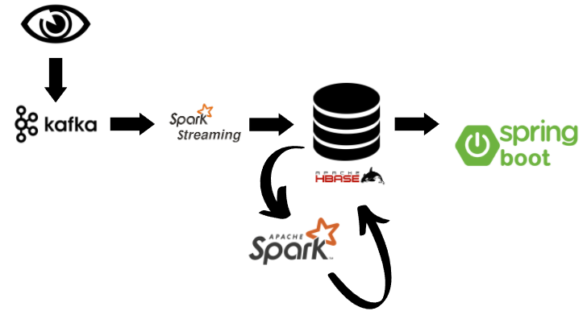
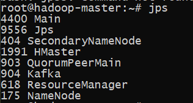

# Watch Data Gathering
Watch Data Gathering is a project that receives a real-time data from users then ingest them to Spark through Kafka. We Use Spark Stream API to process and store data and Spark for later batch 
processing and then is visualized by a spring boot application (which is still in progress)
<br> <br>
Here is the architecture for the project


The project runs with these tools:

- JDK - 1.8
- Maven - 3.3.9
- ZooKeeper - 3.4.8
- Kafka (2.11-1.0.2)
- HBase - 1.4.8
- Spark - 2.7.1 Pre-built for Hadoop 2.7.2

It runs on the following [Docker Image](https://hub.docker.com/r/liliasfaxi/spark-hadoop) which already contains Hadoop, Spark and HBase

Watch Producer is a Maven Composed Project that contains three projects:

- Watch Producer
- Watch Processor
- Watch Batch Processor

JDK 1.8 and Maven are required to build this project.
Docker is also needed to download the image and build the containers.

## 1- Building the containers


And then to create the docker container, use the following command


```sh
  # Downloading the image
  docker pull liliasfaxi/spark-hadoop
  
  # Creating the network
  docker network create --driver=bridge hadoop
  
  # Running the containers
  docker run -itd --net=hadoop -p 50070:50070 -p 8088:8088 -p 7077:7077 -p 16010:16010 --name hadoop-master --hostname hadoop-master liliasfaxi/spark-hadoop:hv-2.7.2
  docker run -itd -p 8040:8042 --net=hadoop --name hadoop-slave1 --hostname hadoop-slave1 liliasfaxi/spark-hadoop:hv-2.7.2
  docker run -itd -p 8041:8042 --net=hadoop --name hadoop-slave2 --hostname hadoop-slave2 liliasfaxi/spark-hadoop:hv-2.7.2
  
```

### Note 
 
To start the containers later on, use this command:

```sh 
    docker start hadoop-master
    docker start hadoop-slave1
    docker start hadoop-slave2
```
<hr>

## 2- Setting up the container
Now we need to set up the container by running Kafka, Zookeeper, HBase and Hadoop

First of all, run this command to open bash in the master container
```sh
docker exec -it hadoop-master bash
```
Now, we need to run these commands one by one to make sure it works!
```sh
./start-hadoop.sh
./start-kafka-zookeeper.sh	
cp -r $HBASE_HOME/lib/* $SPARK_HOME/jars
kafka-topics.sh --create --zookeeper localhost:2181 --replication-factor 1 --partitions 1 --topic watch-data-event
start-hbase.sh
```

To verify if each process is running, just run this command
```sh
jps
```
It should give the following result


Now to set up the HBase, we need to create the needed tables. <br>
To start Hbase, run: 
```sh
hbase shell
```

and then run 
```sh
create 'view','watchDetails','watchedEpisode','userDetails'
create 'total_traffic','data'
create 'window_traffic','data'
create 'batch','data'

``` 
- View: Stores every view details
- Total_traffic: Stores the number of watchers per show
- UserWatchCounter: Stores the numeber of watcher per show in a windowed duration
- Batch: Calculates the number of views per show 
<hr>

## 3- Building the project
Now we need to build the project. <br>
Use below command to build all projects.

```sh
mvn package
```

And then execute the following commands to copy the jar files into the container

```sh
docker cp .\WatchProcessor\target\watch-spark-processor-1.0.0.jar hadoop-master:/root/sparkStreaming.jar
docker cp .\WatchProducer\target\watch-kafka-producer-1.0.0.jar hadoop-master:root/kafka.jar
docker cp .\WatchBatchProcessor\target\watch-spark-batch-processor-1.0.0.jar hadoop-master:/root/sparkBatch.jar
```

# 4- Running the project 

Now to run the project open three bash in hadoop-master container with the following command 
```sh
docker exec -it hadoop-master bash
```

And in each container run the following commands:

## 1- To start sending data:

```sh
java -jar kafka.jar
```

## 2- To start the streaming reception:

```sh
spark-submit --master yarn --deploy-mode client --class "com.watch.app.spark.processor.WatchDataProcessor" sparkStreaming.jar
```

## 3- To start the batch process:

```sh
spark-submit --master yarn --deploy-mode client --class "com.watch.app.spark.processor.WatchBatchProcessor" sparkBatch.jar
```

# That's it
## Leave a Star if you liked the project!
